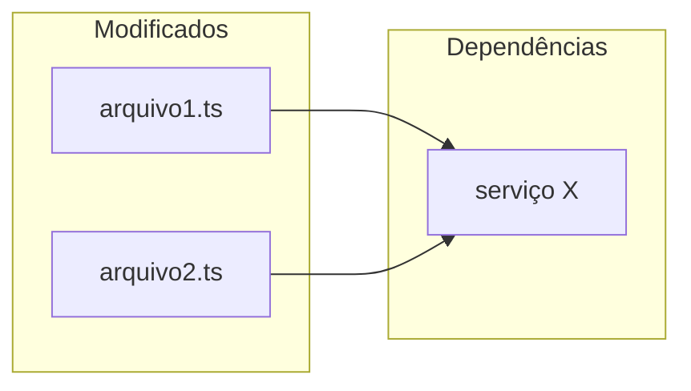

# Reference: template do relatório (/sdd-review)

> Carregado sob demanda pelo `/sdd-review` na Etapa 4 (geração do relatório).
> Caminho do output: `<root>/thoughts/reviews/REV-DD-MM-YYYY-[slug].md`

````markdown
---
date: DD-MM-YYYY (UTC-3)
reviewer: Claude Code
source: "[PR #123 / branch feat/xxx / commit abc1234]"
pr_detected: "[#123 ou null se não houver PR aberto]"
status: reviewed
---

# Review: [Título do PR ou descrição da mudança]

## Resumo Executivo

| Métrica | Valor |
|---|---|
| Arquivos revisados | N |
| Linhas alteradas | +X / -Y |
| Issues críticas | N |
| Issues maiores | N |
| Issues menores | N |
| Funções acima do threshold de complexidade | N (threshold: 10, ferramenta: [lizard/linter/fta/não rodou]) |
| Reviews humanos prévios | N (ver seção abaixo) |
| Aprovação | ✅ Aprovado / ⚠️ Aprovado com ressalvas / ❌ Bloqueado |

## Reviews Anteriores Considerados

> Preencha apenas se houver PR aberto com reviews/comentários humanos. Caso contrário: "Nenhum PR aberto detectado para esta branch — análise puramente local."

| Reviewer | Estado | Data | Resumo |
|---|---|---|---|
| @fulano | CHANGES_REQUESTED | DD-MM-YYYY | [1 linha resumindo os pontos principais] |
| @ciclana | APPROVED | DD-MM-YYYY | [1 linha — ex: aprovou após ajuste de error handling] |

**Issues já apontadas pelos humanos** (não duplicadas neste relatório):

- [arquivo:linha] — @fulano apontou [resumo] → confirmo / não confirmo / parcialmente confirmo
- [arquivo:linha] — @ciclana sugeriu [resumo] → status do feedback prévio

**Decisões controversas já aprovadas por humano**: [se houver, listar — ex: "uso de `any` em X:Y foi aprovado por @fulano com justificativa Z"]

## Mapa de Impacto

> Arquivos modificados e suas dependências — ajuda a visualizar o escopo da mudança.



## O que foi bem

- [aspecto positivo — código limpo, padrão correto, boa cobertura, etc.]

---

## Issues Encontradas

### - [ ] 🔴 CRITICAL — [Título Issue]

**Arquivo**: `caminho/arquivo.ts:linha`
**Confidence**: 95/100
**Descrição**: [O que está errado e por quê é um problema]
**Impacto**: [Consequência se não corrigido]
**Sugestão**: [Como corrigir]

```typescript
// Código atual (problemático)

// Código sugerido
```

---

### - [ ] 🟡 MAJOR — [Título Issue]

**Arquivo**: `caminho/arquivo.ts:linha`
**Confidence**: 85/100
**Descrição**: [...]
**Impacto**: [...]
**Sugestão**: [...]

---

### - [ ] 🔵 MINOR — Nomenclatura: [Título Issue]

**Arquivo**: `caminho/arquivo.ts:linha`
**Confidence**: 80/100
**Descrição**: [Nome confuso ou typo encontrado]
**Sugestão**: renomear `nomeAtual` → `nomeSugerido` — [justificativa]

---

### - [ ] 🔵 MINOR — Query: [Título Issue]

**Arquivo**: `caminho/arquivo.ts:linha`
**Confidence**: 82/100
**Descrição**: [Problema de performance identificado — ex: SELECT sem LIMIT em tabela de crescimento ilimitado]
**Risco em escala**: [O que acontece com N registros]
**Sugestão**: [Query alternativa ou abordagem]

```typescript
// Query atual

// Query otimizada sugerida
```

---

### - [ ] 🟡 MAJOR / 🔵 MINOR — Complexidade: [nome da função]

**Arquivo**: `caminho/arquivo.ts:linha`
**CC**: [N] (threshold: [10], métrica: [ciclomática/cognitiva], ferramenta: [lizard/linter do projeto/fta])
**Descrição**: função [introduzida/modificada] pelo diff com complexidade acima do limite
**Impacto**: difícil de testar (cada caminho é um caso de teste) e de manter
**Sugestão**: [extrair helpers / early returns / substituir cadeia if-else por lookup table / decompor condições — o que se aplica ao caso]

---

### - [ ] 🟡 MAJOR / 🔵 MINOR — Teste: [Título Issue]

**Arquivo**: `caminho/arquivo.test.ts:linha`
**Confidence**: 85/100
**Descrição**: [Problema identificado — ex: 5 `it()` separados testando propriedades do mesmo retorno]
**Impacto**: [Suite inflada, setup duplicado, falsa sensação de cobertura]
**Sugestão**: [Agrupar assertions / reescrever teste]

```typescript
// Teste atual (problemático)

// Teste sugerido
```

---

## Conformidade com Projeto

| Critério | Status | Observação |
|---|---|---|
| CLAUDE.md conventions | ✅ / ⚠️ / ❌ | |
| ARCHITECTURE.md patterns | ✅ / ⚠️ / ❌ | |
| Schema validation | ✅ / ⚠️ / ❌ | |
| Runtime correto (conforme CLAUDE.md) | ✅ / ⚠️ / ❌ | |
| Error handling | ✅ / ⚠️ / ❌ | |
| Test quality | ✅ / ⚠️ / N/A | |

## Referências

- Fonte: [PR #N / branch / commit]
- SPEC relacionada: [caminho em thoughts/plans/, se existir]
- CLAUDE.md constraint relevante: [se algum foi violado]
````
